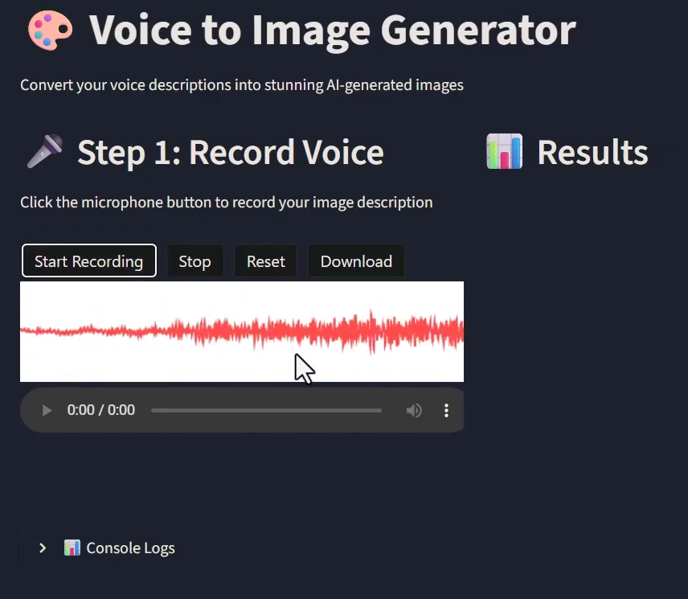
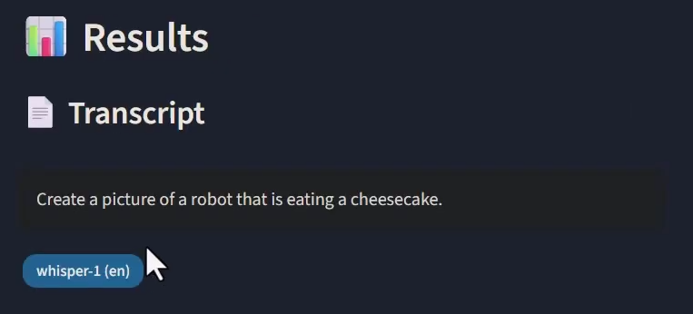
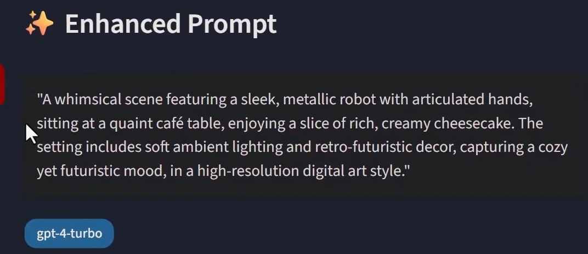
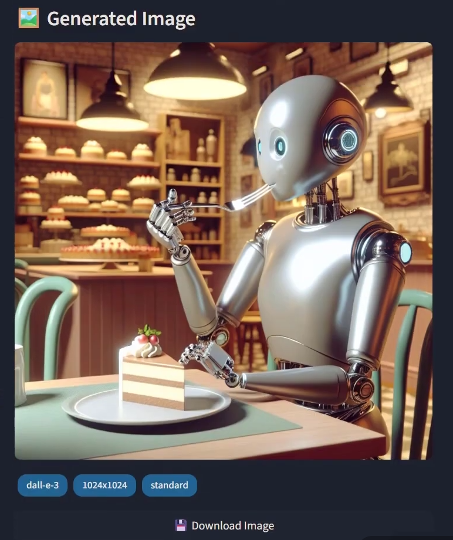

# 🎨 Voice to Image Generator

An AI-powered application that converts voice messages into stunning images using OpenAI's state-of-the-art models.

[Live Demo](https://gen-ai-capstone-two.streamlit.app/)


## 📋 Overview

This application implements a complete voice-to-image pipeline:
1. **🎤 Voice Input** - Record your image description
2. **🎧 Speech-to-Text** - Whisper API transcribes your voice
3. **✨ Prompt Enhancement** - GPT-4 enhances the description
4. **🖼️ Image Generation** - DALL-E 3 creates the image

## 🚀 Features

- ✅ **Browser-Based Voice Recording** - Record directly in the web app, no file upload needed!
- ✅ **Automatic Transcription** - OpenAI Whisper API (English optimized)
- ✅ **Intelligent Prompt Enhancement** - GPT-4 Turbo adds artistic details
- ✅ **High-Quality Image Generation** - DALL-E 3 with customizable settings
- ✅ **Intermediate Data Display** - View transcript, enhanced prompt, and models used
- ✅ **Comprehensive Logging** - Track every step in the console
- ✅ **Download Generated Images** - Save your creations locally
- ✅ **Clean, Modern UI** - Built with Streamlit

## 🛠️ Tech Stack

| Component | Technology |
|-----------|-----------|
| **Framework** | Streamlit |
| **Language** | Python 3.9+ |
| **Speech-to-Text** | OpenAI Whisper API |
| **Prompt Enhancement** | OpenAI GPT-4 Turbo |
| **Image Generation** | OpenAI DALL-E 3 |
| **Logging** | Colorlog |

## 📦 Installation

### Prerequisites

- Python 3.9 or higher
- OpenAI API key ([Get one here](https://platform.openai.com/api-keys))
- Microphone (for browser-based recording)

### Setup Steps

1. **Clone the repository**
   ```bash
   cd Capstone-Project-2
   ```

2. **Create a virtual environment (recommended)**
   ```bash
   python -m venv venv

   # On Windows
   venv\Scripts\activate

   # On macOS/Linux
   source venv/bin/activate
   ```

3. **Install dependencies**
   ```bash
   pip install -r requirements.txt
   ```

4. **Configure environment variables**
   ```bash
   # Copy the example file
   cp .env.example .env

   # Edit .env and add your OpenAI API key
   # OPENAI_API_KEY=sk-your-api-key-here
   ```

5. **Run the application**
   ```bash
   streamlit run app.py
   ```

6. **Open in browser**
   - The app will automatically open at `http://localhost:8501`
   - If not, navigate to the URL shown in the terminal

## 🎯 Usage Workflow

### Step-by-Step Example

[](https://youtu.be/u_VFhApcPEk)


#### 1️⃣ **Initial Screen**
*The application starts with a clean interface showing the record button.*

#### 2️⃣ **Record Voice in Browser**

<p><em>Click the microphone button and speak your image description directly in the browser!</em></p>

**Example voice input:**
> "Create an image of a sunset over mountains with a lake in the foreground"

**How to record:**
1. Click the microphone button
2. Allow browser microphone access when prompted
3. Speak your image description clearly
4. Click stop when done
5. Your audio will be ready for processing!

#### 3️⃣ **View Transcript**

<p><em>Whisper API transcribes your voice message with high accuracy.</em></p>

**Transcript Output:**
```
"Create an image of a sunset over mountains with a lake in the foreground"
Model: whisper-1 (en)
```

#### 4️⃣ **Enhanced Prompt**

<p><em>GPT-4 Turbo enhances your description with artistic details.</em></p>

**Enhanced Prompt Output:**
```
"Breathtaking sunset over majestic mountain peaks with a serene alpine lake
in the foreground, golden and orange hues painting the sky, dramatic clouds,
perfect mirror reflection on calm water, vibrant colors, landscape photography
style, high detail, 8k quality, natural lighting"

Model: gpt-4-turbo
```

#### 5️⃣ **Generated Image**

<p><em>DALL-E 3 creates a stunning image based on the enhanced prompt.</em></p>

**Image Metadata:**
- Model: `dall-e-3`
- Size: `1024x1024`
- Quality: `standard`
- Style: `vivid`

#### 6️⃣ **Console Logs**
*View detailed logs of the entire pipeline.*

**Sample Logs:**
```
[14:32:15] ✓ Audio input received
[14:32:16] ✓ Transcription: "Create an image of a sunset over mountains..."
[14:32:18] ✓ Enhanced prompt: "Breathtaking sunset over majestic mountain..."
[14:32:24] ✓ Image generated: outputs/generated_20241117_143224.png
[14:32:24] 🎉 Pipeline completed in 9.42s
```

## 🎨 Example Use Cases

### 1. **Landscape Photography**
**Voice Input:** *"A misty forest at dawn"*

**Enhanced Prompt:**
```
Ethereal misty forest at dawn, soft golden sunlight filtering through ancient
trees, volumetric fog, dew-covered foliage, peaceful atmosphere, nature
photography style, cinematic lighting, high detail
```

### 2. **Character Design**
**Voice Input:** *"A futuristic robot chef"*

**Enhanced Prompt:**
```
Sleek futuristic robot chef in a modern kitchen, chrome and white metallic
finish, LED lights, holding a chef's knife, digital art style, detailed
mechanical design, professional lighting, 4k quality
```

### 3. **Abstract Art**
**Voice Input:** *"Colorful geometric shapes"*

**Enhanced Prompt:**
```
Vibrant abstract composition of geometric shapes, bold colors including blue,
orange, and purple, overlapping forms, modern art style, clean lines, dynamic
composition, minimalist aesthetic
```

## ⚙️ Configuration

All settings can be customized in the `.env` file:

```env
# OpenAI API Key (Required)
OPENAI_API_KEY=sk-your-api-key-here

# Whisper Configuration
WHISPER_MODEL=whisper-1          # Model name
WHISPER_LANGUAGE=en              # Language code

# GPT-4 Configuration
GPT_MODEL=gpt-4-turbo           # gpt-4-turbo or gpt-4
GPT_TEMPERATURE=0.7             # Creativity (0.0-1.0)

# DALL-E Configuration
DALLE_MODEL=dall-e-3            # dall-e-3
DALLE_SIZE=1024x1024            # 1024x1024, 1024x1792, 1792x1024
DALLE_QUALITY=standard          # standard or hd
DALLE_STYLE=vivid               # vivid or natural

# App Configuration
LOG_LEVEL=INFO                  # DEBUG, INFO, WARNING, ERROR
```

### Model Options

#### DALL-E Sizes
- `1024x1024` - Square (default)
- `1024x1792` - Portrait
- `1792x1024` - Landscape

#### DALL-E Quality
- `standard` - Faster, lower cost (~$0.04 per image)
- `hd` - Higher detail (~$0.08 per image)

#### DALL-E Style
- `vivid` - Hyper-realistic, dramatic (default)
- `natural` - More subtle, natural-looking

## 💰 Cost Estimation

Per image generation (approximate):

| Service | Cost |
|---------|------|
| Whisper API (30 sec audio) | ~$0.003 |
| GPT-4 Turbo (prompt enhancement) | ~$0.01-0.03 |
| DALL-E 3 (1024x1024, standard) | ~$0.04 |
| **Total** | **~$0.05-0.08** |

**Cost-saving tips:**
- Use `standard` quality instead of `hd` (50% cheaper)
- Keep voice messages short and clear
- DALL-E 3 is billed per image, not per API call

## 🐛 Troubleshooting

### Issue: "OpenAI API key not found"
**Solution:** Make sure you've created a `.env` file with your API key:
```bash
OPENAI_API_KEY=sk-your-actual-key-here
```

### Issue: "Microphone not accessible"
**Solution:**
- Click "Allow" when browser asks for microphone permission
- Check browser settings → Privacy → Microphone
- Try using Chrome or Edge browsers
- Ensure you're accessing via `localhost` or `https`

### Issue: "Audio transcription failed"
**Solution:**
- Ensure audio is clear with minimal background noise
- Speak clearly and at a moderate pace
- Check your internet connection
- Verify API key has sufficient credits

### Issue: "Image generation takes too long"
**Solution:**
- DALL-E 3 typically takes 5-15 seconds
- Check OpenAI API status page for outages
- Try again if the request times out

### Issue: "Module not found" errors
**Solution:**
```bash
pip install -r requirements.txt --upgrade
```

## 📁 Project Structure

```
Capstone-Project-2/
├── app.py                          # Main Streamlit application
├── requirements.txt                # Python dependencies
├── .env.example                    # Environment template
├── .env                           # Your configuration (gitignored)
├── .gitignore                      # Git ignore rules
├── README.md                       # This file
│
├── src/
│   ├── voice/
│   │   └── transcriber.py         # Whisper API integration
│   ├── llm/
│   │   └── prompt_enhancer.py     # GPT-4 prompt enhancement
│   ├── image/
│   │   └── generator.py           # DALL-E 3 integration
│   └── utils/
│       └── logger.py              # Console logging
│
├── outputs/                        # Generated images (gitignored)
└── screenshots/                    # Documentation screenshots
```

## 🔒 Security & Privacy

- **API Keys**: Never commit `.env` file to version control
- **Audio Data**: Audio is sent to OpenAI for processing, not stored locally
- **Generated Images**: Saved locally in `outputs/` directory
- **Logs**: Only stored in console, not persisted to disk

## 🧪 Testing

To verify the setup:

```bash
# Test imports
python -c "from src.voice.transcriber import VoiceTranscriber; print('✓ Voice module OK')"
python -c "from src.llm.prompt_enhancer import PromptEnhancer; print('✓ LLM module OK')"
python -c "from src.image.generator import ImageGenerator; print('✓ Image module OK')"

# Run the app
streamlit run app.py
```

## 📊 Models Used

### 1. **OpenAI Whisper API (whisper-1)**
- **Purpose:** Speech-to-text transcription
- **Language:** English-optimized
- **Accuracy:** State-of-the-art voice recognition
- **Cost:** $0.006 per minute

### 2. **OpenAI GPT-4 Turbo**
- **Purpose:** Prompt enhancement and refinement
- **Capabilities:** Adds artistic details, style, composition
- **Context:** Trained on artistic and photographic terminology
- **Cost:** ~$0.01-0.03 per enhancement

### 3. **OpenAI DALL-E 3**
- **Purpose:** Text-to-image generation
- **Quality:** State-of-the-art image generation
- **Capabilities:** Photorealistic, artistic, and abstract styles
- **Cost:** $0.04 (standard) or $0.08 (hd) per image

## 🤝 Contributing

Contributions are welcome! Areas for improvement:

- [ ] Add support for multiple languages in Whisper
- [ ] Implement image history/gallery view
- [ ] Add batch processing for multiple prompts
- [ ] Support for image editing/variations
- [ ] Export logs to file
- [ ] Add preset artistic styles
- [ ] Implement user authentication
- [ ] Add image metadata export

## 📝 License

This project is for educational purposes as part of the Masters in GenAI capstone project.

## 🙏 Acknowledgments

- **OpenAI** - For providing Whisper, GPT-4, and DALL-E 3 APIs
- **Streamlit** - For the amazing web framework
- **Colorlog** - For beautiful console logging

## 📧 Support

For issues or questions:
1. Check the Troubleshooting section above
2. Review the console logs for error messages
3. Verify API key and configuration in `.env`
4. Check OpenAI API status and account credits

---

**Built with ❤️ using OpenAI APIs**

*Whisper + GPT-4 + DALL-E 3*
